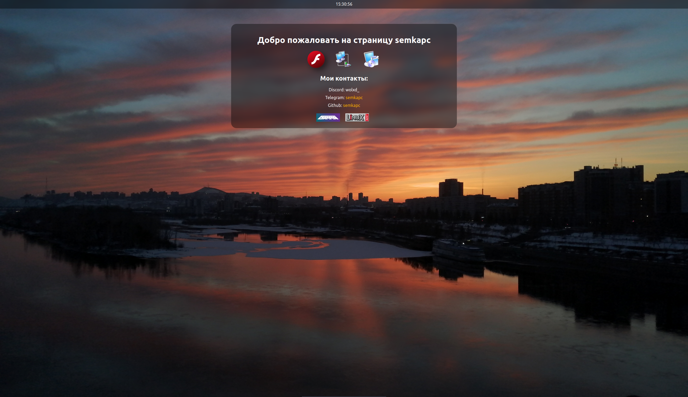
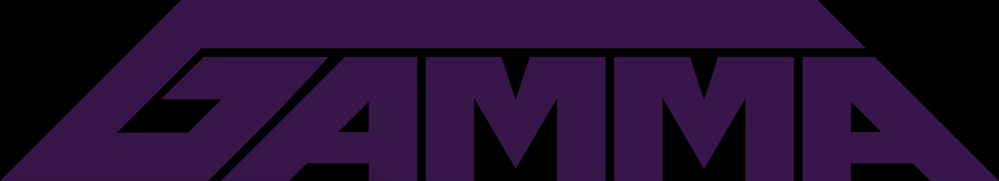

<h1>Современная версия странички</h1> 
<h2>Спасибо огромное Максиму (https://github.com/PatrickStar8753)</h2>
<h2>Еще одна моя страничка (буду ее обновлять еще) <a href="http://semka.w10.site">http://semka.w10.site</a></h2>
<h1>Что есть на сайте?</h1>

Скриншот за 07.04.2025 (15:32 GMT+3)

<h3>Нууу мои контакты и кнопочки на сайты моих друзей</h2>
 

Вот например кнопочка для перехода на сайт моего друга gamma63

<h3>Еще есть раздел с программами, где вы сможете найти ссылки на различные программы не только для Windows, но и для Linux</h2>
<h3>Есть игры, их там не много но и так сойдет :3</h2>
<h3>Tакже вы можете пообщатся с людьми через чат на сайте (возможно переделаю его когда нибудь, и будет он хостится на моем втором компе)</h2>
